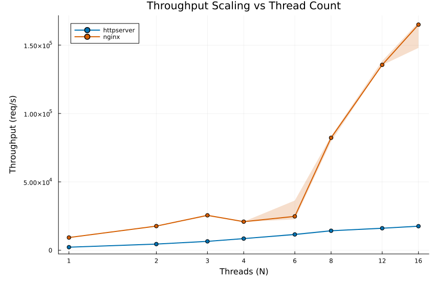
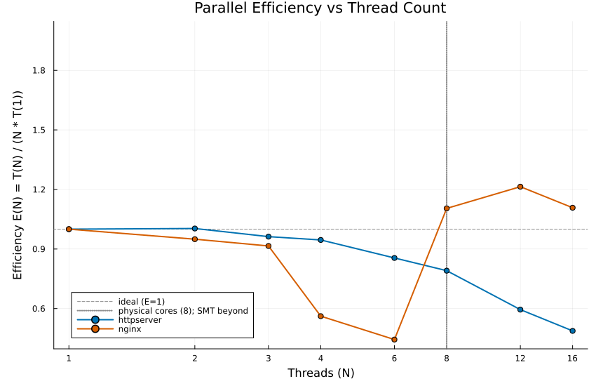
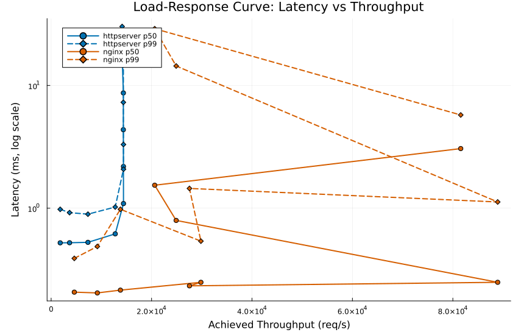
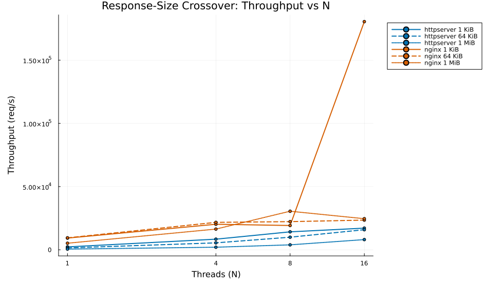
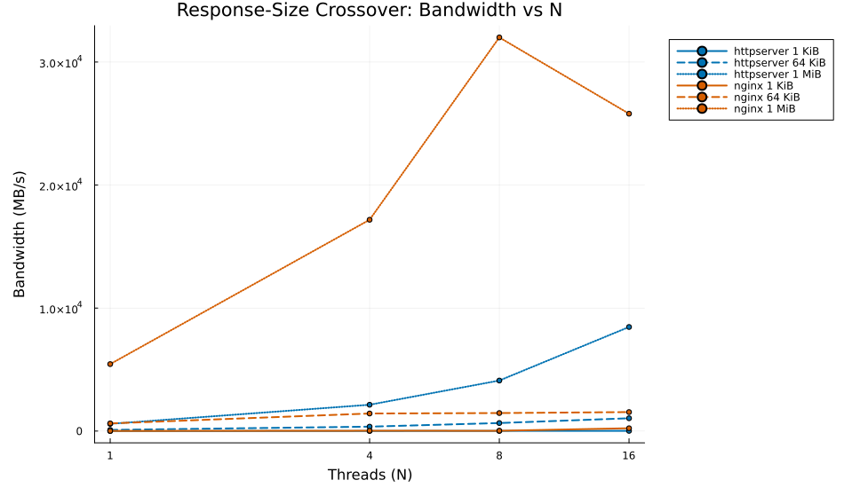
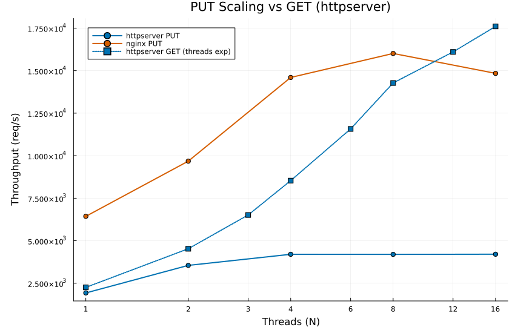
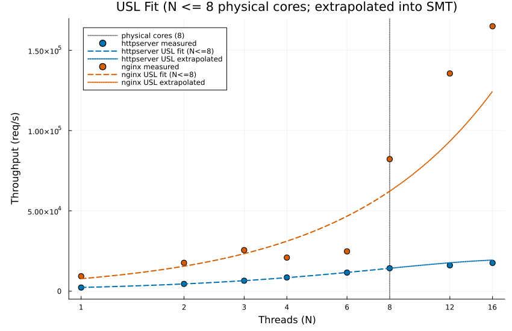

# Performance: http-c-zig vs nginx

A same-box, closed-loop benchmark of this repo's multi-threaded C HTTP server
(`httpserver`) against nginx 1.30.3. All numbers come from a single campaign,
`bench/results/campaign_2026-07-05_015926.csv` (204 measurements), summarized by
`bench/results/analysis_2026-07-05.txt` and plotted into `docs/figures/`. Every
figure below embeds directly from that run; every quoted number is traceable to
that CSV or its analysis.

Read this as an engineering report, not a benchmark scoreboard. Absolute req/s
is a property of this machine; the portable, defensible result is the
**same-box ratio** and the **scaling efficiency** of httpserver's queue/lock
design. Where nginx's numbers are untrustworthy (documented below), they are
flagged rather than quoted as fact.

---

## TL;DR

- **httpserver scales almost ideally across physical cores.** Speedup is 94.6%
  efficient at N=4 and 79.1% at N=8 (8 physical cores); the Universal
  Scalability Law fit gives serialization σ = 2.6% and coherency κ = 0.22%,
  R² = 0.9997. The predicted throughput knee is N ≈ 21 — **the server is not
  near its scalability limit on this box.**
- **Absolute throughput trails nginx, as expected for a read/write-copy server
  vs an event-driven one with `sendfile(2)`.** In the trustworthy N ≤ 6 region
  the httpserver÷nginx ratio is 0.24–0.47, best at N=6 (0.467). The story here
  is scaling *quality*, not peak req/s.
- **The load-response curve is a clean closed-loop hockey stick.** At N=8,
  throughput saturates at ~14.4k req/s; p50 latency rises linearly with queue
  depth from 0.52 ms (c=1) to 17.5 ms (c=256), with **zero errors in all 204
  runs** and no tail-latency regime at any concurrency.
- **PUT throughput plateaus at ~4.2k req/s from N=4 — by design.** The campaign
  PUTs one URI repeatedly, and httpserver serializes same-URI writes under a
  per-URI exclusive `flock` (D12) to keep the audit log linearizable. That
  plateau is the *cost of the correctness guarantee*, not a defect; nginx's DAV
  module takes no such lock and reaches ~16k on the identical workload.
- **nginx's low-N and mid/large-size numbers are unreliable on this box** —
  a stable ~11 ms tail mode at 4 workers, and up to 6× run-to-run spread at
  N ≥ 8. Treat those as noise; httpserver's curve is monotonic by construction.

---

## Methodology

### Machine

| Property | Value |
|---|---|
| CPU | AMD Ryzen 7 9800X3D, 8 physical cores / 16 logical (SMT) |
| Kernel | Linux 6.6.87.2-microsoft-standard-WSL2 (WSL2) |
| Transport | loopback (127.0.0.1) |
| nginx | 1.30.3 |
| Governor | n/a (not exposed under WSL2) |

Provenance is captured per-run in `bench/results/campaign_2026-07-05_015926.meta`.

Two caveats to keep front-of-mind for every number below:

1. **WSL2 is a virtualized scheduler.** Timers, core pinning, and preemption are
   the host's Hyper-V scheduler, not bare metal. This inflates run-to-run
   variance, especially for the many-process nginx configurations (see the
   anomaly discussion).
2. **Loopback is not a NIC.** There is no wire, no interrupt coalescing, no
   driver. This favors the server that can hand bytes to the kernel most
   cheaply — which is exactly why nginx's `sendfile(2)` + page-cache path pulls
   away at large response sizes (§Bandwidth). Loopback measures the server's
   syscall/copy path, not network behavior.

### Load generator

Load is driven by `bench/loadgen.zig` (built as `bench-loadgen`), a Zig-native
**closed-loop, one-request-per-connection** generator written specifically for
this server. httpserver is strictly one-request-per-connection (it closes the
socket after each response); off-the-shelf tools mismodel this — `oha` only
approximates it with `--disable-keepalive`, and `wrk` actively fights it
(keep-alive + reconnect, logging a socket error on every close). The generator
instead does exactly what the server expects: **connect → send one request →
drain the response to EOF → close, repeat.** nginx is configured with
`keepalive_timeout 0` so both servers see the identical connection model.

- **Closed loop:** `-c CONN` worker threads, each with exactly one outstanding
  request at a time. Throughput = completed responses / wall-clock. This is a
  *coordinated-omission-free* design in the sense that a slow response stalls
  its own thread and directly caps that thread's issue rate — but it is
  therefore **closed-loop**, not open-loop: reported latency is per-request
  service time under a fixed client population, not the response time an
  open-arrival load would see. Latency is sampled per thread (each thread owns
  its samples, merged after join — no cross-thread contention on the hot path)
  and reported as p50/p90/p99.
- **Framing:** trivial and identical for both servers — each closes the socket
  after one response, so "read to EOF" *is* the full body; only the status line
  is parsed, reusing ztest's `wire.zig` so framing matches the server-under-test
  by construction.

### Experiment matrix

The campaign (`bench/campaign.sh`) runs four designed experiments against each
server. Every point launches a **fresh server**, does one **discarded 1 s
warmup** run, then **3 recorded 4 s runs**; downstream analysis takes medians.
Fixed offered load is c = 64 unless the experiment sweeps concurrency.

| Experiment | Question | Swept | Fixed |
|---|---|---|---|
| `threads` | T(N): throughput vs worker count | N ∈ {1,2,3,4,6,8,12,16} | c=64, GET, 1 KiB |
| `conc` | load response at fixed N | c ∈ {1,2,4,8,16,32,64,128,256} | N=8, GET, 1 KiB |
| `size` | response-size crossover | size ∈ {1 KiB, 64 KiB, 1 MiB} × N ∈ {1,4,8,16} | c=64, GET |
| `put` | write-path scaling | N ∈ {1,2,4,8,16} | c=64, PUT, 1 KiB |

### Statistical treatment

- Medians over 3 reps throughout; min/max retained so run-to-run spread is
  visible (the analysis flags any point whose min–max range exceeds 10% of its
  median as an anomaly — 25 were found, 20 of them nginx; httpserver's five
  are one 13% rep spread on the 1 MiB GET at N=16 and four sub-2%
  wiggles at saturation).
- Efficiency **E(N) = T(N) / (N · T(1))**: 1.0 is linear speedup.
- The USL fit is done **on N ≤ 8 only** — the physical-core regime. Past N=8 the
  server's worker threads share 8 physical cores with each other *and* with the
  64 client threads of the load generator, so E(N) for N ∈ {12,16} measures SMT
  yield plus generator interference, not the server's parallel efficiency. Those
  points are shown but not fit.

---

## Results

### Thread scaling: throughput



httpserver throughput climbs monotonically and near-linearly through the
physical-core regime: 2256 → 4527 → 6513 → 8533 req/s at N = 1/2/3/4, then
11 572 (N=6) and 14 274 (N=8). Into the SMT regime it keeps rising but with
diminishing return — 16 100 (N=12), 17 600 (N=16) — because those extra workers
are hyperthreads contending with the load generator, not new cores.

nginx is faster in absolute terms everywhere, but its curve is **not
monotonic** and has a pathological dip: 25 553 req/s at N=3 *falls* to 20 909 at
N=4, before recovering to 82 238 at N=8 and 164 962 at N=16. That N=3→N=4
regression is not a fluke of one rep — see the load-response and caveats
sections. httpserver, by contrast, has no non-monotonic point anywhere in the
thread sweep.

### Thread scaling: efficiency



This is httpserver's strongest result. Efficiency stays essentially ideal
through mid-scale:

| N | httpserver E(N) | nginx E(N) |
|---|---|---|
| 1 | 1.000 | 1.000 |
| 2 | 1.003 | 0.949 |
| 3 | 0.962 | 0.915 |
| 4 | 0.946 | 0.562 |
| 6 | 0.855 | 0.444 |
| 8 | 0.791 | 1.105 |

httpserver holds 94.6% efficiency at N=4 and 79.1% at N=8 — a well-behaved,
gently declining curve, exactly the signature of a design whose only shared
state on the GET hot path is a bounded work queue and a per-URI *shared* lock.
The dispatcher accepts every connection and hands it to the queue; workers
contend only on the queue mutex and (for reads) a `LOCK_SH` flock that does not
serialize concurrent readers. There is no global request lock to erode E(N).

nginx's E(N) column is not interpretable as parallel efficiency: it drops to
0.44 at N=6 (the tail-mode artifact) and then exceeds 1.0 at N ≥ 8. A
super-linear "efficiency" is the tell that the N=1 baseline was anomalously slow
and/or SMT and cache effects dominate — nginx's own architecture (N worker
*processes*, not threads, sharing one listen socket) makes E(N) a different
quantity than it is for httpserver. This is why the honest comparison is the
raw throughput ratio, not a side-by-side of E(N).

### Load response at fixed N=8



Sweeping offered concurrency against 8 workers produces a textbook closed-loop
saturation curve for httpserver:

| c | throughput (req/s) | p50 (ms) | p99 (ms) |
|---|---|---|---|
| 1 | 1 805 | 0.522 | 0.979 |
| 4 | 7 330 | 0.527 | 0.894 |
| 8 | 12 763 | 0.618 | 1.022 |
| 16 | 14 409 | 1.091 | 2.078 |
| 64 | 14 378 | 4.360 | 7.288 |
| 256 | 14 138 | 17.508 | 30.217 |

Throughput rises linearly while there is a free worker per client (c ≤ 8), then
saturates flat at ~14.4k req/s once c ≥ 16 — i.e. once offered concurrency
exceeds the worker count, additional clients only wait in the queue. Past
saturation, **p50 rises linearly with queue depth** (0.52 ms → 17.5 ms as
c goes 1 → 256) — the canonical closed-loop signature: added clients convert
directly into queueing delay, throughput held constant. There is **no error
floor** (0 errors at every concurrency, verified across all 204 campaign runs)
and **no tail blow-up**: p99 tracks p50 at a steady ~1.7× multiple all the way
out. This is the bounded-queue design (D17) doing its job — backpressure is
uniform, not a cliff.

nginx on the same sweep is erratic once c ≥ 16 (throughput 27.5k → 88.9k →
24.9k → 20.6k → 81.6k across c = 16/32/64/128/256, with run-to-run spread up to
190% of the median at c=64). Its p50 stays low (~0.2–3 ms) but the throughput
itself is not reproducible in this regime; those points are not quoted as
comparative results.

### Response-size crossover



Fixing load and sweeping response size shows where the server's cost model
shifts from per-request overhead to per-byte copying. For httpserver, small
(1 KiB) responses scale to 17 135 req/s at N=16 (request-rate bound), while
large (1 MiB) responses top out at 8070 req/s at N=16 — the same worker count,
an order of magnitude fewer requests, because each request now moves a megabyte
through `read()`/`write()` copies. The medium (64 KiB) curve sits between,
reaching 15 889 req/s at N=16.

The crossover interpretation: at 1 KiB the server is bound by request framing
and dispatch overhead (which parallelize cleanly); at 1 MiB it is bound by
memory-copy bandwidth through the worker's user-space buffer. httpserver never
uses `sendfile(2)` — it `read()`s the file into a heap buffer and `write()`s it
to the socket (D1/D5 keep the `conn_t` I/O path explicit and portable), so a
large GET pays two copies per byte.

### Bandwidth



At 1 MiB responses, httpserver reaches **8462 MB/s (~8.5 GB/s) at N=16 and is
still climbing** — bandwidth grows monotonically with workers (588 → 2140 →
4108 → 8462 MB/s at N = 1/4/8/16), so the read/write-copy path is not yet
saturated at 16 workers.

nginx peaks around **32 000 MB/s (~32 GB/s) at N=8** on the same 1 MiB GET. The
~4× gap is **expected mechanism, not mystery**: nginx serves static files with
`sendfile(2)`, which splices file pages directly from the page cache to the
socket inside the kernel with zero user-space copies, and on loopback the
"transmit" is a page-cache-to-page-cache move. httpserver's explicit
`read()`-into-buffer-then-`write()` path pays two copies per byte by design.
This is a copy-path vs zero-copy comparison, and on a NIC-less loopback it is
maximally favorable to the zero-copy side. (nginx's large/medium bandwidth
numbers are also the *least* reproducible in the campaign — see caveats — so
the 32 GB/s figure is best read as an order-of-magnitude ceiling, not a precise
value.)

### PUT: write-path scaling



This is the result most likely to be misread as a weakness, so it is stated
carefully.

| N | httpserver PUT (req/s) | nginx PUT (req/s) |
|---|---|---|
| 1 | 1 930 | 6 434 |
| 2 | 3 550 | 9 678 |
| 4 | 4 202 | 14 599 |
| 8 | 4 197 | 16 010 |
| 16 | 4 207 | 14 840 |

httpserver PUT scales from N=1 to N=2, then **plateaus flat at ~4.2k req/s from
N=4 onward** — adding workers buys nothing. nginx keeps climbing to ~16k. Read
naively this looks like a 4× loss. It is not; it is the measurement showing the
correctness guarantee working.

**The campaign PUTs the *same* URI on every request** (`campaign.sh` writes to
one fixed path per size). httpserver serializes concurrent same-URI writes under
a **per-URI exclusive `flock` on a sidecar lockfile** (DECISIONS.md **D12**):
`LOCK_EX` for PUT, held across the existence check → open → truncate → body
write → audit-log write. This is *required* by the spec's linearizability
guarantee — the 200-vs-201 status of each PUT must be consistent with audit-log
order, which forces the existence decision and the audit write to happen
atomically under one continuously-held per-URI lock. With every request
targeting one URI, that critical section is a hard serialization point:
**the ~4.2k plateau is precisely the throughput of one URI's write critical
section on this box**, and no number of workers can exceed it because they are
all contending for the same lock.

nginx's DAV module takes **no such lock** — concurrent PUTs to the same file
race, last-write-wins, and it makes no audit-ordering promise — so it
parallelizes the writes and reaches ~16k. This is a **correctness-vs-throughput
trade**, not a performance defect: httpserver is buying linearizable audit
ordering (the property watson gates on) with that serialization, and paying for
it exactly here. A **multi-URI PUT sweep** — distinct URIs per request — would
exercise httpserver's parallel write path (distinct URIs get distinct locks and
distinct lockfiles, D12), and is expected to scale; that experiment is not in
this campaign and is listed under Future Work.

---

## Model: Universal Scalability Law



Fitting the Universal Scalability Law to httpserver's physical-core throughput,

T(N) = λN / (1 + σ(N−1) + κN(N−1))

yields (N ≤ 8, `analysis_2026-07-05.txt`):

| Coefficient | Value | Meaning |
|---|---|---|
| λ | 2323.8 req/s/thread | ideal per-worker throughput |
| σ | 0.0258 (2.6%) | serialization / contention (linear-in-N loss) |
| κ | 0.00222 (0.22%) | coherency / crosstalk (quadratic-in-N loss) |
| R² | 0.9997 | goodness of fit |

The fit is excellent and the coefficients are small, and both facts have a
concrete cause in the design:

- **σ = 2.6% serialization** is the fraction of work that cannot run in
  parallel — here, the queue mutex the dispatcher and workers share, plus the
  audit-log mutex (D10). That it is only 2.6% means the shared queue is a cheap,
  short critical section: the dispatcher's job is `accept()` + enqueue, and a
  worker holds the queue lock only long enough to dequeue.
- **κ = 0.22% coherency** is the near-zero quadratic term — cache-line
  bouncing and cross-worker coordination. On the GET workload this is small
  because GET takes a *shared* per-URI flock (`LOCK_SH`, D12): readers do not
  serialize against each other, so there is almost no write-shared state on the
  hot path to ping between cores.

The predicted scalability knee — where added workers stop increasing
throughput — is at N* = √((1−σ)/κ) ≈ **21 workers**, beyond the 16 logical
threads this box has. **httpserver is nowhere near its own scalability limit
here;** on hardware with more physical cores it would be expected to keep
scaling to ~N=21 before the coherency term turns the curve over.

The two SMT-regime points confirm the fit rather than contradict it: measured
N=12 and N=16 land **~9% *below*** the physical-core USL extrapolation
(16 100 vs 17 683 predicted; 17 600 vs 19 365). That deficit is expected — those
are hyperthreads sharing 8 cores with a 64-thread load generator, so each yields
less than a real core — and its small, consistent size is itself evidence the
N ≤ 8 model is sound.

**nginx cannot be modeled this way on this data.** Its USL fit is degenerate
(R² = 0.71, both σ and κ pinned at 0) because its fit-region data is
non-monotonic (the N=3→4 regression) — the analysis prints an explicit
**POOR FIT** caveat, and its coefficients are meaningless. No nginx scalability
coefficient is quoted anywhere in this document for that reason.

---

## Findings from follow-up investigation

Three behaviors in the raw data warranted a closer look. Hypotheses are labeled
as such; they are plausible mechanisms, not proven causes.

### 1. nginx has a slow-mode tail at low worker counts

At `worker_processes = 4`, nginx exhibits a **stable slow mode**. The campaign's
three N=4 reps land at 20 662 / 20 909 / 20 975 req/s with p50 ≈ 1.9 ms but
**p99 pinned at ~11.2 ms in every rep** (10.5 / 11.2 / 11.6 ms) — a fixed,
reproducible tail. A separate set of three independent fresh launches
reproduced the same regime (23.8k / 23.3k / 21.3k req/s, p50 ≈ 1.9 ms, p99
≈ 11.3 ms every launch — recorded in
`bench/results/followup_2026-07-05_nginx_n4.txt`). Yet at N=3 nginx does 25 553 req/s with p99 only
2.9 ms, and at N=8 the tail *collapses* (p99 ~3 ms) and throughput jumps to
~82k — then 135k/165k at N=12/16. So the N=3→N=4 throughput regression and the
11 ms p99 appear and disappear together.

**Hypothesis:** uneven `accept()` pickup across workers sharing the listen
socket. nginx runs without `accept_mutex` by default, so which worker accepts a
given connection is a kernel-scheduling race; under the WSL2 scheduler at
exactly 4 workers, a minority of connections appear to stall ~11 ms waiting for
a worker to pick them up, and in a closed loop each stalled connection caps its
client thread's issue rate — dragging aggregate throughput below the N=3 point.
At N=8 there are enough workers that every connection is accepted promptly and
the tail vanishes.

**Contrast:** httpserver has a **single dispatcher** that `accept()`s every
connection and feeds one bounded queue (D17); connection distribution to workers
is fair by construction, not a per-worker accept race. Its throughput curve is
monotonic and its p99 well-behaved at every N — there is no tail regime to
appear or disappear.

### 2. nginx mid/large-size throughput is bimodal and unreliable

Single nginx points show up to **6× run-to-run spread**. The starkest: `size`
experiment, medium (64 KiB) GET, N=16 — three reps of 142 555 / 23 334 / 23 478
req/s (range 508% of the median). Of the campaign's 14 rep-spread anomalies,
**13 are nginx**; the lone httpserver anomaly is a 13% spread on the 1 MiB GET
at N=16 (7504–8563 req/s), an order of magnitude tighter. **Consequence, stated
plainly: nginx's absolute numbers at N ≥ 8, and all nginx medium/large-size
numbers, are not reliable on this box** and are not used as comparative
baselines. This is a WSL2 + many-process-scheduling artifact, and it is one more
reason the trustworthy comparison region is N ≤ 6.

### 3. The honest headline

In the trustworthy N ≤ 6 region, the same-box **httpserver ÷ nginx throughput
ratio is 0.24–0.47** (0.242 / 0.256 / 0.255 / 0.408 / 0.467 at N = 1/2/3/4/6),
best at **0.467 at N=6**. httpserver moves roughly a quarter to a half of
nginx's req/s per core against an event-driven server that uses `sendfile(2)`
and runs a mature epoll event loop. That gap is real and expected for a
thread-per-request, copy-path server.

The result worth reporting is not that ratio — it is that **httpserver's scaling
is nearly ideal (σ = 2.6%, R² = 0.9997, knee at N ≈ 21)** and its behavior is
*predictable*: monotonic throughput, linear-in-queue-depth latency, zero errors,
no tail regime, and a PUT plateau that is exactly the price of a correctness
guarantee nginx does not offer. On this hardware httpserver is a well-scaling,
well-behaved server that is slower in absolute terms than a zero-copy event loop
— which is the honest and useful thing to say about it.

---

## Caveats

- **WSL2 virtualization** inflates variance, especially for nginx's N-process
  configurations (findings 1 and 2). Bare-metal Linux numbers would be tighter
  and possibly different in absolute level; the *ratios* and *scaling shape* are
  the portable takeaways.
- **Closed-loop, coordinated-omission-free but not open-loop.** Reported latency
  is per-request service time under a fixed client population, not the response
  time an open Poisson arrival process would see. Do not read p99 here as an SLA
  number for open-world traffic.
- **Localhost loopback ≠ a real NIC.** No wire, no interrupts, no driver — this
  maximally favors nginx's zero-copy `sendfile` path at large sizes (§Bandwidth).
- **nginx is architecturally different:** N worker *processes* sharing one
  listen socket vs httpserver's N worker *threads* behind one dispatcher.
  "N processes" and "N threads" are not the same unit, which is why nginx's E(N)
  and USL fit are not interpretable and are not quoted.
- **Absolute req/s is machine-specific.** The AMD 9800X3D's large L3 cache
  flatters small-response workloads. The same-box ratio and the USL coefficients
  are the numbers that travel.

### Future work

- **Multi-URI PUT sweep** — distinct URIs per request, to measure httpserver's
  *parallel* write path (distinct D12 locks) instead of one URI's serialized
  critical section. This is the missing complement to §PUT and is expected to
  scale where the same-URI sweep plateaus.
- **Open-loop / bounded-arrival load** to characterize latency under queueing
  independent of the closed-loop client population.
- **Bare-metal Linux re-run** to separate server behavior from WSL2 scheduler
  variance (findings 1 and 2).

---

## Reproduction

Both steps run inside the repo's Nix dev shell.

```bash
# 1. Run the full campaign (fresh CSV + .meta under bench/results/).
#    Tunables via env — see the header of bench/campaign.sh
#    (EXPERIMENTS, THREADS_SWEEP, CONC_SWEEP, SIZES, PUT_SWEEP, CONC, DUR,
#    REPS, WARMUP_S). Needs real cores; not a CI job.
nix develop -c bash bench/campaign.sh

# 2. Analyze + regenerate figures into docs/figures/.
nix develop -c julia bench/analysis/analyze.jl bench/results/campaign_<stamp>.csv
```

The data behind this document is `bench/results/campaign_2026-07-05_015926.csv`
(+ `.meta` for machine provenance); the analysis summary is
`bench/results/analysis_2026-07-05.txt`.
